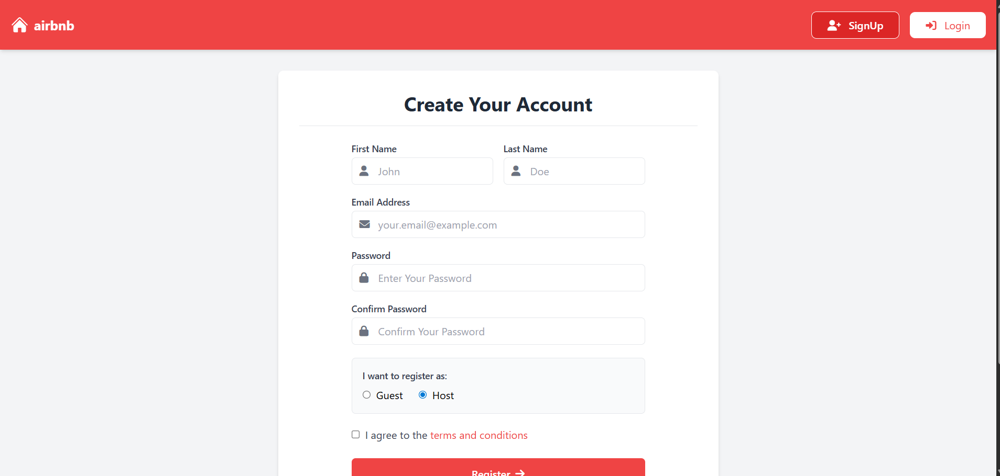
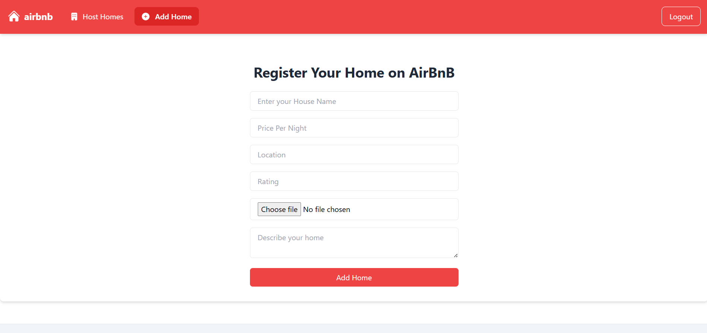
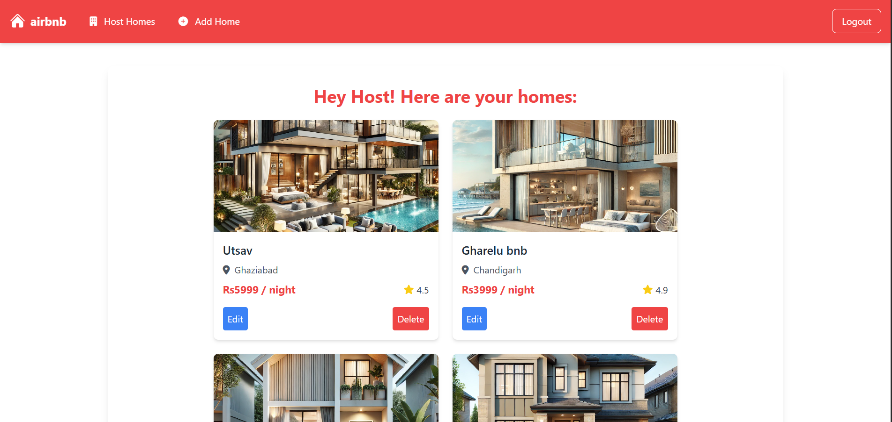
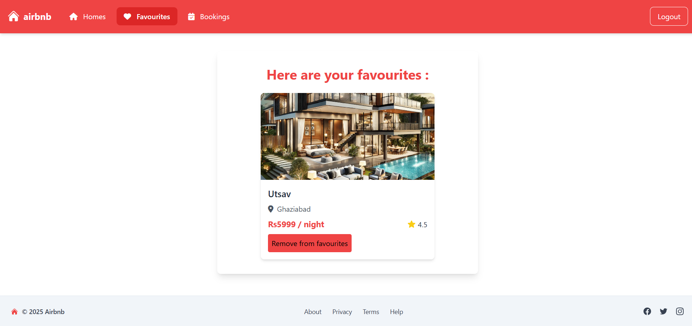

# Airbnb Clone

## ✨ Features

- User authentication (signup/login)
- Host can add, edit, and manage homes
- Users can browse homes
- Users can favorite homes
- Users can book homes
- Responsive UI with Tailwind CSS

## 🛠️ Tech Stack

- Node.js
- Express.js
- MongoDB & Mongoose
- EJS (Embedded JavaScript Templates)
- Tailwind CSS
- Helmet & Compression (Security & Performance)

## 🖼️ Screenshots

### 🏡 Home Page

### 🔑 Login Page

### ➕ Add Home (Host)

### 📋 Host Homes List

### ⭐ Favourites
 